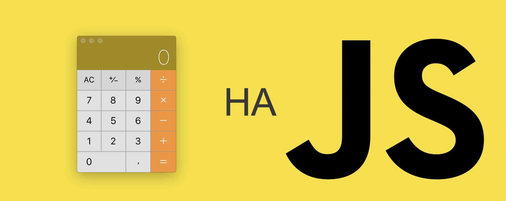

<h2>Пишем свой калькулятор на JavaScript</h2>
<br>
Создаем собственный калькулятор на JavaScript с помощью JS, HTML и CSS.<br>
Вначале, как говорится, была идея, то есть ТЗ самому себе - написать калькулятор на чистом JS, чтобы количество кода было минимальным.<br>
Ну, и конечно, чтобы калькулятор выглядил прилично. <br> 
Итак, поехали.

Поскольку экран и кнопки на калькуляторе находятся не подряд друг за другом, то раздедим наш калькулятор не несколько областей:
1. Область ввода данных. За эту область будет отвечать текстовое поле < input >;
2. Область цифровых кнопок 0-9;
3. Область функциональных кнопок: +, /, *, =, AC;
4. Кнопка подсчета операции

Теперь попробуем все эти области отобразить в коде:

```
<textarea id=result>0</textarea>
<button>1</button>
<button>2</button>
<button>3</button>
<button>4</button>
<button>5</button>
<button>6</button>
<button>7</button>
<button>8</button>
<button>9</button>
<button>0</button>
<button>+</button>
<button>-</button>
<button>*</button>
<button>/</button>
<button>=</button>
<button>C</button>
<button>#</button>
```
Немного громоздко. А если представить, что кнопок будет 200-300, то такой код будет просто лесом одиковых строк с минимальными различиями. Это выглядит не очень хорошо.
Добавим для этого кода обёртку div и немного css

```
<div id="calc">
  <textarea id=result>0</textarea>
  <button>1</button>
  ...
</div>
```

Посмотреть вживую - здесь: https://jsfiddle.net/raman_shastapalau/hpvkos30/2/

Все равно, получается громоздко. Чтобы уменьшить количество кода, воспользуемся div-ами, в которые будем возвращать данные из массивов. И облагородим всё это с помощью css

```
<div id="wrap">
    <div id="calc">
      <textarea id="result">0</textarea>
      <div id="numpad">
        <div id="buttonNum"></div>
        <div id="buttonOper"></div>
      </div>
      <div id="buttonCalc"></div>
    </div>
</div>
```
Вот что получилось - каркас калькулятора. Пока еще без кнопок, ну разве что с макетов кнопки "="<br>
https://jsfiddle.net/raman_shastapalau/hpvkos30/4/ <br>
В массивы мы положим все кнопки - цифры, функциональные и кнопку "="". Кнопки < button >1</ button > вообще можем убрать - их чуть ниже добавим с помощью JS

```
let buttons = ['7', '8', '9', '4', '5', '6', '1', '2', '3', '.', '0','AC'];
let operations = ['/', '*', '-', '+'];
let calculations = ['='];
```
И с помощью метода getElementById будем возвращать необходимые данные в документ со следующими id: buttonCalc и result

```
let textArea = document.getElementById('result');
let calculation = document.getElementById('buttonCalc');
```
Теперь, пройдемся по массиву buttons с помощью метода forEach и затем будем отрисовывать кнопки, оборачивая их в div, добавляя класс btn.

```
buttons.forEach(function (button) {
    let buttonElement = document.createElement('div');
    buttonElement.className = 'btn';
    buttonElement.innerHTML = button;
    buttonNum.appendChild(buttonElement);
});
```

Далее пройдемся по массивам с функциолальными кнопками и кнопке "="
```
operations.forEach(function (operation) {
    let operationElement = document.createElement('div');
    operationElement.className = 'operation';
    operationElement.innerHTML = operation;
    buttonOper.appendChild(operationElement);
});

calculations.forEach(function (calculation) {
    let calculationElement = document.createElement('div');
    calculationElement.className = 'calculation';
    calculationElement.innerHTML = calculation;
    buttonCalc.appendChild(calculationElement);
});
```
И затем с помощью метода querySelectorAll пройдемся по всему документу, найдем #wrap .btn

```
document.querySelectorAll('#wrap .btn').forEach(function (button) {

        button.addEventListener('click', onButtonClick);
    });
```
Вот что в итоге получилось - вывели данные из массива в div элементы: https://jsfiddle.net/raman_shastapalau/hpvkos30/5/ <br>
Кнопки правда не работают, но для этого нужно написать обработчик событий на нажание кнопки с помощью onButtonClick. Поскольку пишем калькулятор, то в нем возможно несколько нажатий функциональных кнопок. Поэтому пройдемся по вариантам нажатий кнопок с помощью else if

```
function onButtonClick(e) {
        // e - MouseEvent (получает информацию о клике)
        if (e.target.innerHTML === 'c') {
            // При нажатии кнопки "с", стирается все из текстового поля
            textArea.innerHTML = '0';
        } else if (e.target.innerHTML === '=') {
            // При нажатии кнопки "=", происходит вычисление значения с помощью eval
            textArea.innerHTML = eval(textArea.innerHTML);
        } else if (textArea.innerHTML === '0') {
            // Если textarea содержит только "0", то стереть "0" и записать значения кнопки в текстовое поле
            textArea.innerHTML = e.target.innerHTML;
        } else {
            // Добавление значения кнопки в текстовое поле
            textArea.innerHTML += e.target.innerHTML;
        }
    }
```
Вот в принципе и все, смотрим результат по ссылке: https://jsfiddle.net/raman_shastapalau/hpvkos30/7/ <br>
Если не нравится расположение кнопок калькулятора - меняйте их в массиве. 

```
let buttons = ['7', '8', '9', '4', '5', '6', '1', '2', '3', '.', '0','AC'];
```
Не забывайте подключить скрипт внизу страницы, иначе работаеть не будет.